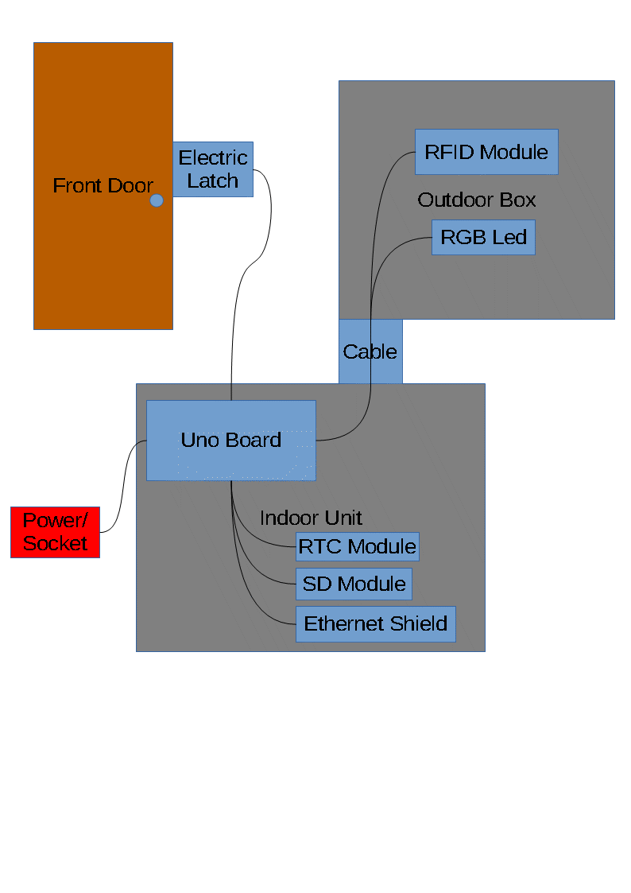

# Secure RFID Access Control

The aim of this project is to make a secure access control system to open my front door with Mifare RFID tags.

If you set this up yourself, you will need to change the Mifare keys which are in the code.
My setup worked for a while and then just stopped working, throwing errors saying that it couldn't find the SD module. I think was because of the bad quality component.
I have stopped working with this project and am now focusing on my RPi-face-recognition project.

When you scan a tag the Uno reads the UID, authenticates Key A and B and the AC bits, and compares the data in block 2 of the selected sector to the file on the SD card with the name corresponting to the UID of the tag.

## Circuit Diagram

The relay at the top left connects to the electric door lock which will unlock when the relay is powered.

I am using:
1. ELEGOO UNO (Same as Arduino Uno but cheaper)
1. MFRC-522 RFID IC Card Inductive Sensors Module 
1. Micro SD Card Module 
1. WS2812B 5050 RGB LED Strip 30 LEDs/M ws2812 IC Individual Addressable 5V
1. I2C RTC DS1307 AT24C32 Real Time Clock Module 

Any help or sugestions would be appreciated.
